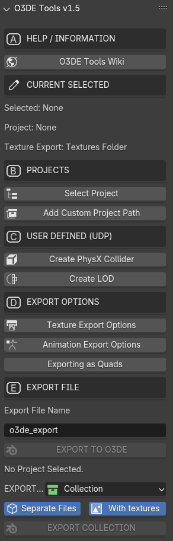

This repository is for continuing the work on the O3DE->Blender bridge. This add-on currently is WIP. The plan for the next version is outlined below. This bridge add-on might be hosted under O3DE later.

- [x] Version bumps and Blender 4.x compatibility enhancement.

- [ ] (WIP) Change the license to Blender compliant GPL license.

- [ ] (WIP) Collections based workflow. 

- [ ] (WIP) GLTF support. 

- [ ] Flatten multiple actions into a single animation channel for the export.

- [ ] Export action clips as individual FBX files.

- [ ] Sample O3DE asset pack.

- [ ] (WIP) Provide Mannequin Man.

- [ ] (WIP) Drop FBX support.

**UI**

